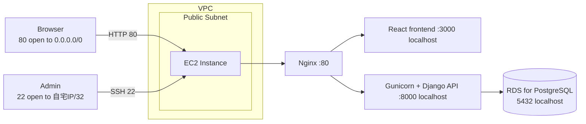

## AWS構成図

```mermaid
flowchart LR
  USER[Browser<br/>80 open to 0.0.0.0/0] -->|HTTP 80| EC2[EC2 Instance]
  ADMIN[Admin<br/>22 open to 自宅IP/32] -->|SSH 22| EC2

  subgraph VPC
    subgraph Public Subnet
      EC2
    end
  end

  EC2 --> NGINX[Nginx :80]
  NGINX --> REACT[React frontend :3000 localhost]
  NGINX --> DJANGO[Gunicorn + Django API :8000 localhost]
  DJANGO --> PG[(RDS for PostgreSQL<br/>5432 localhost)]
```

